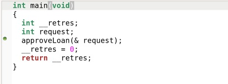
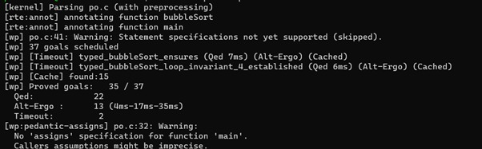
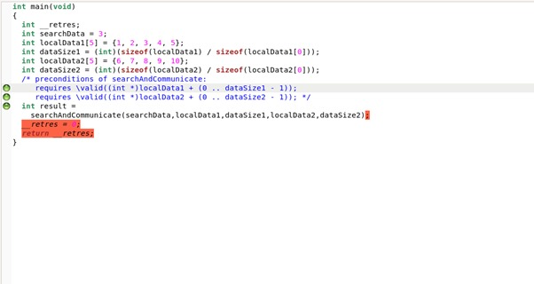

# Blockchain Smart Contracts Formalization: Decentralized Lending System

This repository contains the formalization of a decentralized lending system using blockchain smart contracts, implemented and verified in C and Frama-C, with additional Alt-Ergo code for formal verification. The system addresses key use cases in traditional finance, such as accessibility, transparency, and reduced reliance on intermediaries. Below are the code snippets, formal specifications, and associated images as presented in the original document.

## Overview

A decentralized lending system enables capital access without traditional banks, enhances trust through tamper-proof blockchain records, allows interest earning on crypto assets, simplifies loan access without complex credit checks, and reduces intermediary costs. All axioms are equally contributed.

## If Statement

### C Code: Loan Approval

```c
#include <stdio.h>

int approveLoan(int *request) {
    int approval = 0; 
    if (*request > 0) {
        if (*request <= 1000) {
            approval = 1; 
        } else {
            approval = 0;
        }
    } else {
        approval = 0; 
    }
    return approval;
}

int main() {
    int loanRequest;
    printf("Enter the loan request amount: ");
    scanf("%d", &loanRequest);
    int result = approveLoan(&loanRequest);
    printf("Loan approval result: %d\n", result);
    return 0;
}
```

### Frama-C Code: Loan Approval with Specifications

```c
#include <stdio.h>

/*@ requires \valid(request);
  ensures \result == 0 || \result == 1;
  behavior valid_request:
      assumes *request > 0 && *request <= 1000;
      ensures \result == 1;
    behavior invalid_request:
      assumes *request <= 0 || *request > 1000;
      ensures \result == 0;
*/

int approveLoan(int *request) {
    int approval = 0; 
    if (*request > 0) {
        if (*request <= 1000) {
            approval = 1; 
        } else {
            approval = 0; 
        }
    } else {
        approval = 0; 
    }
    return approval;
}

int main() {
    int loanRequest;
    printf("Enter the loan request amount: ");
    scanf("%d", &loanRequest);
    int result = approveLoan(&loanRequest);
    if (result == 1) {
        printf("Loan approved!\n");
    } else {
        printf("Loan rejected. Please enter a valid loan amount.\n");
    }
    return 0;
}
```




### Alt-Ergo Code

```
goal c:
       forall request :int.
       request>=1000->
           (request=500 
           or(not(request=500) and request=0))
```


## Loops

### C Code: Loan Repayment

```c
#include <stdio.h>

void repayLoan(int *loanAmount) {
    int repayments = 0;
    while (repayments < *loanAmount) {
        repayments += 100;
    }
    *loanAmount = 0;
}

int main() {
    int loanAmount = 1000;
    repayLoan(&loanAmount);
    return 0;
}
```

### Frama-C Code: Loan Repayment with Specifications

```c
#include <stdio.h>

/*@
  requires \valid(loanAmount);
  requires *loanAmount > 0;
  assigns *loanAmount;
  ensures *loanAmount == 0;
*/

void repayLoan(int *loanAmount) {
    int repayments = 0;
    /*@
     loop invariant 0 <= repayments <= *loanAmount;
     loop assigns repayments, *loanAmount;
     loop variant *loanAmount - repayments;
     */
    while (repayments < *loanAmount) {
        //@ assert 0 <= repayments <= *loanAmount;
        repayments += 100;
    }
    //@ assert repayments == *loanAmount; 
    *loanAmount = 0; 
}

int main() {
    int loanAmount = 1000;
    repayLoan(&loanAmount);
    return 0;
}
```


## User Defined

### Frama-C Code: Loan Request and Interest Calculation

```c
#include <stdio.h>

typedef struct {
    float loanAmount;
    float interestRate;
    int durationMonths;
} LoanRequest;

/*@
    requires \valid(request);
    assigns *request;
    ensures request->loanAmount >= 0.0;
    ensures request->interestRate >= 0.0;
    ensures request->durationMonths >= 0;
    ensures \separated(request, &request->loanAmount, &request->interestRate, &request->durationMonths);
*/

void requestLoan(LoanRequest *request) {
    scanf("%f", &request->loanAmount);
    scanf("%f", &request->interestRate);
    scanf("%d", &request->durationMonths);
}

/*@
    requires loanAmount >= 0.0;
    requires interestRate >= 0.0;
    requires durationMonths >= 0;
    assigns \nothing;
    ensures \result >= 0.0;
*/

float calculateInterest(float loanAmount, float interestRate, int durationMonths) {
    float interest = loanAmount * (interestRate / 100.0) * (durationMonths / 12.0);
    return interest;
}

/*@
    assigns \nothing;
*/

int main() {
    LoanRequest request;
    requestLoan(&request);
    float interest = calculateInterest(request.loanAmount, request.interestRate, request.durationMonths);
    printf("Calculated Interest: %.2f\n", interest);
    return 0;
}
```


## Assert Condition: Interest Rate Validation

### C Code

```c
#include <stdio.h>
#include <assert.h>

int isInterestRateNonNegative(float interestRate) {
    return interestRate >= 0;
}

int isInterestRateWithinRange(float interestRate, float minRate, float maxRate) {
    return interestRate >= minRate && interestRate <= maxRate;
}

int main() {
    float offeredInterestRate = 2.5;  
    float minAcceptableRate = 0;
    float maxAcceptableRate = 5;      
    assert(isInterestRateNonNegative(offeredInterestRate));
    assert(isInterestRateWithinRange(offeredInterestRate, minAcceptableRate, maxAcceptableRate));
    printf("Interest rate validation passed.\n");
    return 0;
}
```

### Frama-C Code

```c
#include <stdio.h>

/*@
    requires \forall float x; x >= 0;
    assigns \nothing;
    ensures \result == interestRate; 
*/

float assertInterestRateNonNegative(float interestRate) {
    return interestRate;
}

/*@
    requires \forall float x; x >= 0 && x <= 10; 
    assigns \nothing;
    ensures \result == interestRate;
*/

float assertInterestRateWithinRange(float interestRate) {
    return interestRate;
}

/*@
    assigns \nothing;
*/

int main() {
    float interestRate = 3.5;
    if (interestRate < 0) {
        printf("Interest rate cannot be negative.\n");
    } else {
        interestRate = assertInterestRateNonNegative(interestRate);
        if (interestRate > 10) {
            printf("Interest rate should be within the range of 0 to 10.\n");
        } else {
            interestRate = assertInterestRateWithinRange(interestRate);
        }
    }
    return 0;
}
```


## User Defined Function: Loan Request

### C Code

```c
#include <stdio.h>

typedef struct {
    float loanAmount;
    float interestRate;
    int durationMonths;
    char collateral[50];
} LoanRequest;

void requestLoan() {
    LoanRequest request;
    printf("Enter loan amount: ");
    scanf("%f", &request.loanAmount);
    printf("Enter interest rate: ");
    scanf("%f", &request.interestRate);
    printf("Enter loan duration in months: ");
    scanf("%d", &request.durationMonths);
    printf("Enter collateral (if applicable): ");
    scanf("%49s", request.collateral);
    printf("\nLoan request details:\n");
    printf("Loan Amount: %.2f\n", request.loanAmount);
    printf("Interest Rate: %.2f%%\n", request.interestRate);
    printf("Duration (Months): %d\n", request.durationMonths);
    printf("Collateral: %s\n", request.collateral);
}

int main() {
    requestLoan();
    return 0;
}
```

### Frama-C Code

```c
#include <stdio.h>

typedef struct {
    float loanAmount;
    float interestRate;
    int durationMonths;
    char collateral[50];
} LoanRequest;

/*@
    requires \valid(request);
    assigns *request;
    ensures request->loanAmount >= 0.0;
    ensures request->interestRate >= 0.0;
    ensures request->durationMonths >= 0;
    ensures request->collateral[0] != '\0';
*/

void requestLoan(LoanRequest *request) {
    scanf("%f", &request->loanAmount);
    scanf("%f", &request->interestRate);
    scanf("%d", &request->durationMonths);
    scanf("%49s", request->collateral);
}

/*@
    ensures \result == 0;
*/

int main() {
    LoanRequest request;
    requestLoan(&request);
    return 0;
}
```


## Pointers

### Frama-C Code

```c
#include <limits.h>

/*@
requires \valid(pre_amount) && \valid(c_amount);
requires INT_MAX - *pre_amount >= *c_amount && *pre_amount >= 0 && *c_amount >= 0;
assigns *pre_amount;
ensures *pre_amount == \old(*pre_amount)+ *c_amount;
ensures *c_amount == \old(*c_amount);
*/

int increment(int* pre_amount, int* c_amount){
    *pre_amount += *c_amount;
    return *pre_amount;
}

int main(){
    int pre_amount = 50000;
    int c_amount = 25000;
    int total;
    total = increment(&pre_amount,&c_amount);
    //@ assert total == pre_amount +c_amount;
    //@ assert total <=100000;
}
```


## Mutable Arrays

### C Code

```c
void lendMoney(double accounts[], int userId, double amount) {
    if (userId >= 0 && userId < 5 && amount > 0 && accounts[userId] >= amount) {
        accounts[userId] -= amount;
    } else {
    }
}

int main() {
    double userAccounts[] = {10000.0, 5000.0, 8000.0, 12000.0, 6000.0};
    lendMoney(userAccounts, 2, 1000.0);
    lendMoney(userAccounts, 4, 1500.0);
    lendMoney(userAccounts, 6, 500.0); 
    lendMoney(userAccounts, 1, -200.0); 
    return 0;
}
```

### Frama-C Code

```c
/*@
  requires \valid(accounts + (0..4));
  ensures \forall integer k; 0 <= k < 5 ==> accounts[k] >= 0;
  assigns accounts[0..4];
*/

void lendMoney(double accounts[], int userId, double amount) {
    if (userId >= 0 && userId < 5 && amount > 0 && accounts[userId] >= amount) {
        accounts[userId] -= amount;
        //@ assert accounts[userId] >= 0; 
    } else {
        //@ assert \false; 
    }
}

int main() {
    double userAccounts[] = {10000.0, 5000.0, 8000.0, 12000.0, 6000.0};
    lendMoney(userAccounts, 2, 1000.0);
    lendMoney(userAccounts, 4, 1500.0);
    lendMoney(userAccounts, 6, 500.0); 
    lendMoney(userAccounts, 1, -200.0); 
    //@ assert \valid(userAccounts + (0..4)); 
    //@ assert 0 <= 2 < 5 && 1000.0 > 0; 
    //@ assert 0 <= 4 < 5 && 1500.0 > 0; 
    return 0;
}
```


### Alt-Ergo Code

```
goal c:
    forall amount :int.
    amount=4000->
        (amount>=3000
        or(not(amount>=3000) and amount<3000))
```


## Sorting

### Frama-C Code: Bubble Sort

```c
#include <stdio.h>

/*@
requires n >= 0 && \valid(amounts + (0..n-1));
ensures \forall integer k; 0 <= k < n-1 ==> amounts[k] <= amounts[k+1];
assigns amounts[0..n-1];
*/

void bubbleSort(int n, int amounts[]) {
    /*@
      loop invariant 0 <= i <= n;
      loop invariant \forall integer k; 0 <= k < i ==> \forall integer l; 0 <= l < n - i - 1 ==> amounts[l] <= amounts[l+1];
      loop assigns i, amounts[0..n-1];
      loop variant n - i;
    */
    for (int i = 0; i < n - 1; i++) {
        /*@
          loop invariant 0 <= j <= n - i - 1;
          loop invariant \forall integer k; 0 <= k < n - i - 1 ==> amounts[k] <= amounts[k+1];
          loop assigns j, amounts[0..n-1];
          loop variant n - i - j;
        */
        for (int j = 0; j < n - i - 1; j++) {
            if (amounts[j] > amounts[j + 1]) {
                int temp = amounts[j];
                amounts[j] = amounts[j + 1];
                amounts[j + 1] = temp;
            }
        }
    }
}

int main() {
    int numLoans = 5;
    int loanAmounts[] = {3000, 1500, 5000, 2000, 1000};
    bubbleSort(numLoans, loanAmounts);
    /*@ 
      assigns \nothing;
    */
    return 0;
}
```




## Searching

### C Code

```c
#include <stdio.h>
#include <stdlib.h>

int searchOnNode(int nodeID, int searchData, int* localData, int dataSize) {
    for (int i = 0; i < dataSize; ++i) {
        if (localData[i] == searchData) {
            return 1;
        }
    }
    return 0;
}

int communicateBetweenNodes(int senderID, int receiverID, int searchData, int* localData1, int dataSize1, int* localData2, int dataSize2) {
    int found = searchOnNode(receiverID, searchData, localData2, dataSize2);
    return found;
}

int main() {
    int searchData = 3; 
    for (int nodeID = 0; nodeID < 3; ++nodeID) {
        int localData[] = {1, 2, 3, 4, 5};
        int dataSize = sizeof(localData) / sizeof(localData[0]);
        int foundLocally = searchOnNode(nodeID, searchData, localData, dataSize);
        if (!foundLocally) {
            for (int otherNodeID = 0; otherNodeID < 3; ++otherNodeID) {
                if (otherNodeID != nodeID) {
                    int foundRemotely = communicateBetweenNodes(nodeID, otherNodeID, searchData, localData, dataSize, localData, dataSize);
                    if (foundRemotely) {
                        break;  
                    }
                }
            }
        }
    }
    return 0;
}
```

### Frama-C Code

```c
#include <stdio.h>

/*@
  requires \valid(localData1 + (0 .. dataSize1-1));
  requires \valid(localData2 + (0 .. dataSize2-1));
  ensures \result == 1 ==> (\exists integer i; 0 <= i < dataSize2 && localData2[i] == searchData);
  ensures \result == 0 ==> (\forall integer i; 0 <= i < dataSize2 ==> localData2[i] != searchData);
  assigns \nothing;
*/

int searchAndCommunicate(int searchData, int* localData1, int dataSize1, int* localData2, int dataSize2) {
    for (int i = 0; i < dataSize1; ++i) {
        if (localData1[i] == searchData) {
            return 1;
        }
    }
    for (int i = 0; i < dataSize2; ++i) {
        if (localData2[i] == searchData) {
            return 1; 
        }
    }
    return 0; 
}

int main() {
    int searchData = 3; 
    int localData1[] = {1, 2, 3, 4, 5};
    int dataSize1 = sizeof(localData1) / sizeof(localData1[0]);
    int localData2[] = {6, 7, 8, 9, 10};
    int dataSize2 = sizeof(localData2) / sizeof(localData2[0]);
    int result = searchAndCommunicate(searchData, localData1, dataSize1, localData2, dataSize2);
    return 0;
}
```





## Immutable Arrays

### C Code

```c
double findMaxBalance(double accountBalances[], int numParticipants) {
    double maxBalance = accountBalances[0];
    for (int participants = 1; participants < numParticipants; participants++) {
        if (accountBalances[participants] > maxBalance) {
            maxBalance = accountBalances[participants];
        }
    }
    return maxBalance;
}

int main() {
    int numParticipants = 5;
    double accountBalances[] = {1000.0, 2000.0, 1500.0, 3000.0, 2500.0};
    double maxBalance = findMaxBalance(accountBalances, numParticipants);
    return 0;
}
```

### Frama-C Code

```c
/*@
  requires numParticipants > 0;
  requires \valid_read(accountBalances + (0 .. numParticipants - 1));
  ensures \forall integer participant; 0 <= participant < numParticipants ==> \result >= accountBalances[participant];
*/

double findMaxBalance(double accountBalances[], int numParticipants) {
    double maxBalance = accountBalances[0];
    /*@
      loop invariant \forall integer participant; 0 <= participant < participants ==> maxBalance >= accountBalances[participant];
      loop invariant 1 <= participants <= numParticipants;
      loop assigns participants, maxBalance;
      loop variant numParticipants - participants;
    */
    for (int participants = 1; participants < numParticipants; participants++) {
        if (accountBalances[participants] > maxBalance) {
            maxBalance = accountBalances[participants];
        }
    }
    return maxBalance;
}

int main() {
    int numParticipants = 5;
    double accountBalances[] = {1000.0, 2000.0, 1500.0, 3000.0, 2500.0};
    double maxBalance = findMaxBalance(accountBalances, numParticipants);
    //@ assert maxBalance >= accountBalances[0];
    return 0;
}
```


### Alt-Ergo Code

```
goal c:
    forall x,y,z :int.
    (x=3 and y=2 and z=1)->
        ((x>y) and (x>z) and (x>0)
        or(not((x>y) and (x>z)) and (y>x) and (y>z) and (y>0))
        or(not((x>y) and (x>z)) or ((y>x) and (y>z)) and (z>0)))
```


## Linear Temporal Logic

- **Always (Globally) Operator (G):** Ensures a property holds at every moment.  
  Example: `G(loan_repaid→contract_closed)`
- **Eventually Operator (F):** Asserts a property will eventually become true.  
  Example: `F(totalRepayments >= loanAmount)`
- **Until Operator (U):** Specifies one property holds until another becomes true.  
  Example: `loan_repaidUcontract_closed`
- **Next Operator (X):** Indicates a property holds in the next time step.  
  Example: `X(interest_payment_due)`

## Axiomatic

### Frama-C Code

```c
#include <stdio.h>

/*@
  axiomatic UserAxiomatics {
    logic integer userCount;
    axiom initial_user_count: userCount == 0;
    predicate ValidUserCount(integer count) = 0 <= count <= 100;
  }
*/

/*@
  axiomatic LoanAxiomatics {
    logic integer loanCount;
    axiom initial_loan_count: loanCount == 0;
    predicate ValidLoanCount(integer count) = 0 <= count <= 100;
  }
*/

int userCount;
int loanCount;

/*@
  requires \valid(users + (0..99)) && \valid(loans + (0..99));
  assigns userCount, loanCount, users[0..99], loans[0..99];
  ensures ValidUserCount(userCount) && ValidLoanCount(loanCount);
*/

void initializeSystem(int users[100], int loans[100]) {
    for (int i = 0; i < 100; ++i) {
        users[i] = 0;
        loans[i] = 0;
    }
    userCount = 0;
    loanCount = 0;
}

/*@
  requires ValidUserCount(userCount) && userCount < 100;
  assigns userCount, users[0..99];
  ensures ValidUserCount(userCount);
*/

void registerUser(int users[100]) {
    users[userCount] = userCount + 1;
    userCount++;
}

/*@
  requires ValidLoanCount(loanCount) && loanCount < 100;
  assigns loanCount, loans[0..99];
  ensures ValidLoanCount(loanCount);
*/

void requestLoan(int loans[100]) {
    loans[loanCount] = loanCount + 1;
    loanCount++;
}

int main() {
    int users[100];
    int loans[100];
    initializeSystem(users, loans);
    registerUser(users);
    requestLoan(loans);
    return 0;
}
```


  